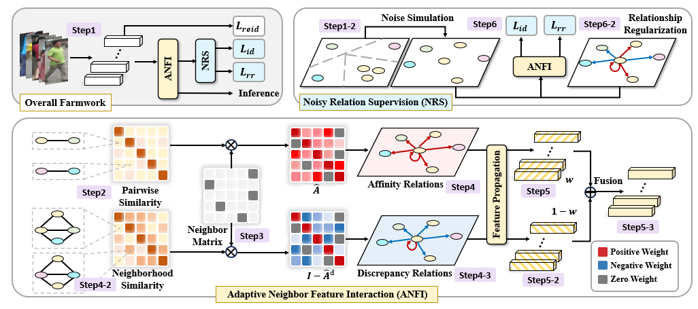

<div align="center">

# ANFI

ANFI: Rethinking Neighbor Feature Interaction in Person Re-ID


</div>

> [!NOTE]
> 👤 面向 person re-identification，围绕噪声邻居下的邻居特征交互，展示亲和关系、差异关系与自适应融合权重的建模思路。

<p align="center">
  
</p>

## ✅ Overview

ANFI 针对 neighbor-based person re-identification 方法对邻居可靠性的依赖，重新组织邻域交互流程，在同一框架中建模 affinity relations 与 discrepancy relations，并通过 sample-wise adaptive weighting 适应不同可靠性的邻域分布。相关图件覆盖方法框架、邻域可靠性分析、噪声关系监督与实验可视化等内容。

画图 PPT 保留了从草稿到成品的逐步修改过程，包含结构调整、视觉层级、配色和排版的连续版本。

## 🔗 Quick Links

| Type | Link |
| --- | --- |
| 📄 Paper | [ANFI: Rethinking Neighbor Feature Interaction in Person Re-ID](https://arxiv.org/abs/2607.25407) |

## 📚 Citation

```bibtex
To be updated.
```
