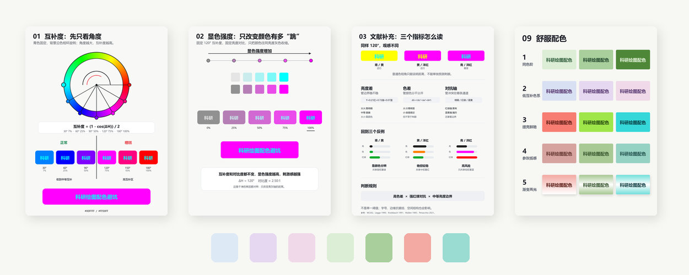

# 配色分析

科研绘图配色避坑与视觉舒适度分析

> [!NOTE]
> 🎨 围绕刺眼配色、互补度、显色强度、对比度与舒适配色反推的科研绘图配色分析。

  

## ✨ Overview

配色分析整理了科研绘图中容易产生视觉不适的文本与背景搭配，并从互补关系、显色强度、亮度对比、字体影响、纸质感配色等角度进行可视化分析。

## 🔗 Quick Links

| Type | Link |
| --- | --- |
| 🎞 Slides | [配色分析.pptx](./配色分析.pptx) |
| 📕 Social | [小红书介绍](http://xhslink.com/o/9frz2vr2R8o) |
