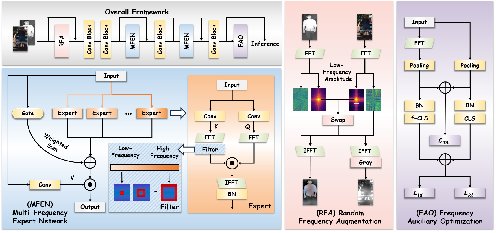

<div align="center">

# MFEN

MFEN: Multi-Frequency Expert Network for Visible-Infrared Person Re-ID

[](https://openaccess.thecvf.com/content/CVPR2026/html/Li_MFEN_Multi-Frequency_Expert_Network_for_Visible-Infrared_Person_Re-ID_CVPR_2026_paper.html)
[](https://arxiv.org/abs/2606.12051)

</div>

> [!NOTE]
> 🌗 面向可见光-红外行人重识别，从数据、模型和优化三个层面利用频域信息，缓解由光照差异导致的跨模态差异。

<p align="center">
  
</p>

## ✅ Overview

MFEN 针对 visible-infrared person re-identification 中由光照、波长和光源差异带来的模态鸿沟，提出 Multi-Frequency Expert Network 进行多频段自适应建模，并结合 Random Frequency Augmentation 与 Frequency Auxiliary Optimization 强化频域特征学习。

## 🔗 Quick Links

| Type | Link |
| --- | --- |
| 📄 Paper | [MFEN: Multi-Frequency Expert Network for Visible-Infrared Person Re-ID](https://arxiv.org/abs/2606.12051) |

## 📚 Citation

```bibtex
@inproceedings{li2026mfen,
  title={MFEN: Multi-Frequency Expert Network for Visible-Infrared Person Re-ID},
  author={Li, Xulin and Lu, Yan and Liu, Bin and Yang, Qinhong and Chu, Qi and Gong, Tao and Yu, Nenghai},
  booktitle={Proceedings of the IEEE/CVF Conference on Computer Vision and Pattern Recognition},
  pages={18471--18480},
  year={2026}
}
```
