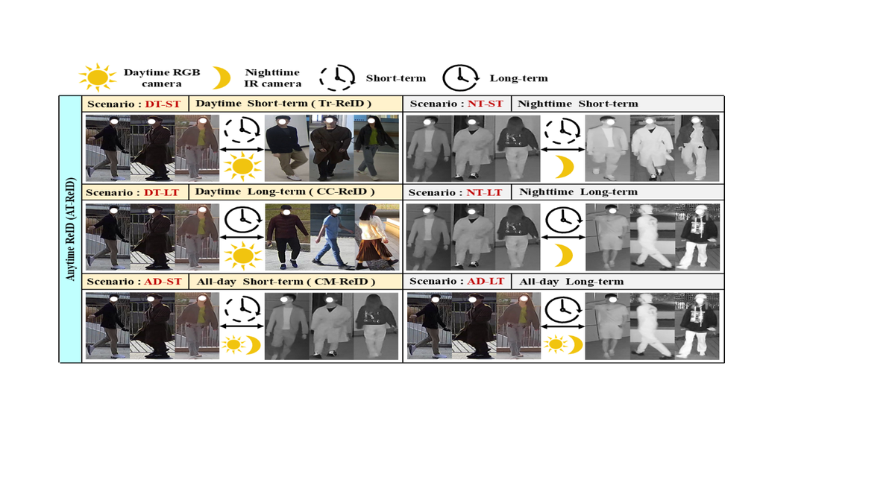
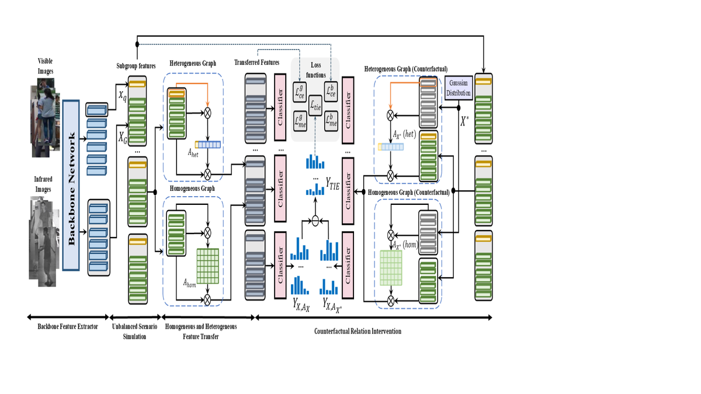
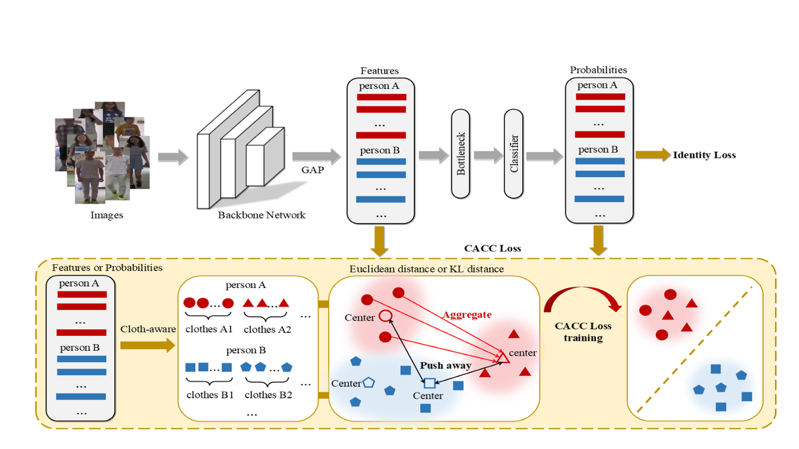
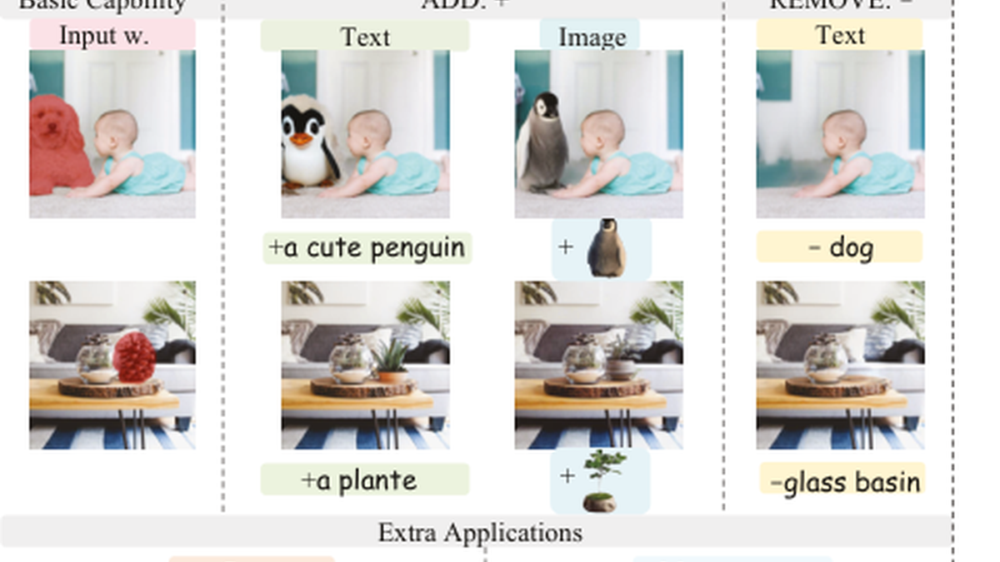

# 科研绘图

从草图到成品的科研绘图资料仓，集中收录多个项目的绘图源文件、海报、报告幻灯片与其他可编辑展示资产。

> [!TIP]
> 这个仓库更像一个科研绘图导航页：代码仓、论文、知乎、小红书和展示资产被分层整理，不再混在同一个 README 首屏里。

## 🖼️ 项目预览

<table>
  <tr>
    <td align="center" width="50%">
      
       
      <strong>👤 AT-ReID</strong>
       
      Anytime Person Re-Identification
    </td>
    <td align="center" width="50%">
      
       
      <strong>🌗 CIFT</strong>
       
      Visible-Infrared Person Re-identification
    </td>
  </tr>
  <tr>
    <td align="center" width="50%">
      
       
      <strong>👕 CACC</strong>
       
      Cloth-Changing Person Re-identification
    </td>
    <td align="center" width="50%">
      
       
      <strong>🎨 MagicPaint</strong>
       
      Image Inpainting with Diffusion Model
    </td>
  </tr>
</table>

## 🧭 项目导航

| Project | Topic | Resources |
| --- | --- | --- |
| [AT-ReID](./AT-ReID) | 👤 Anytime Person Re-Identification | [Paper](https://arxiv.org/abs/2509.16635) / [Repo](https://github.com/kw66/AT-ReID) / [小红书](http://xhslink.com/o/8czcPQfNziK) |
| [CIFT](./CIFT) | 🌗 Visible-Infrared Person Re-identification | [Paper](https://arxiv.org/abs/2208.00967) / [知乎](https://zhuanlan.zhihu.com/p/552705108) / [小红书](http://xhslink.com/o/9Q48HKNssj6) |
| [CACC](./CACC) | 👕 Cloth-Changing Person Re-identification | [Paper](https://link.springer.com/chapter/10.1007/978-3-031-18907-4_41) / [小红书](http://xhslink.com/o/2IpZCVmnoM6) |
| [MagicPaint](./MagicPaint) | 🎨 Image Inpainting with Diffusion Model | [Paper](https://doi.org/10.1609/aaai.v40i14.38151) / [Repo](https://github.com/littleYaang/MagicPaint) / [小红书](http://xhslink.com/o/1mBuHa2IU4U) |

## 📦 仓库定位

- 这个仓库只存放科研绘图与展示资产，不承载训练或评测代码。
- 仍然直接用于主代码仓 README 展示的导出图，可以继续保留在对应代码仓中。
- 具体到每个项目的论文、社媒与引用信息，请进入各自子目录查看。
