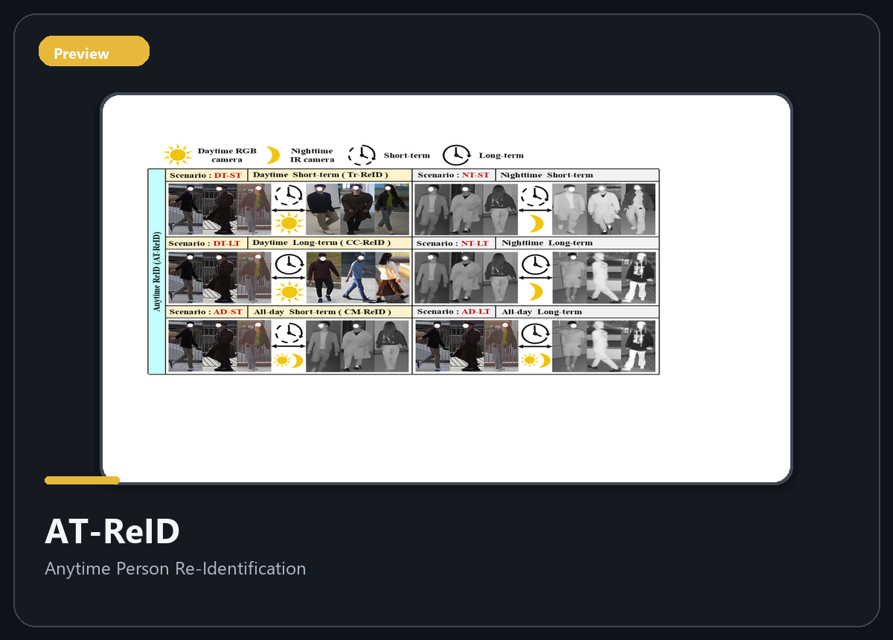
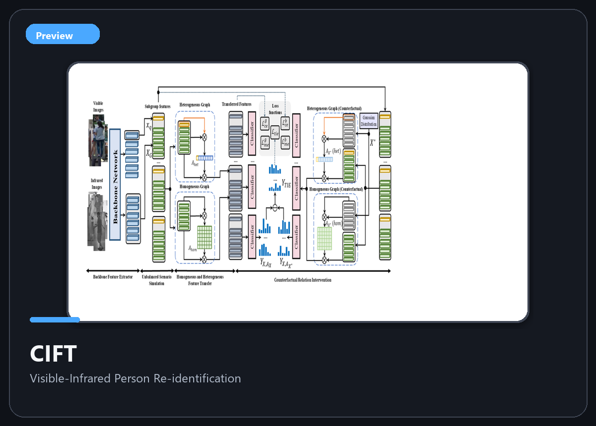
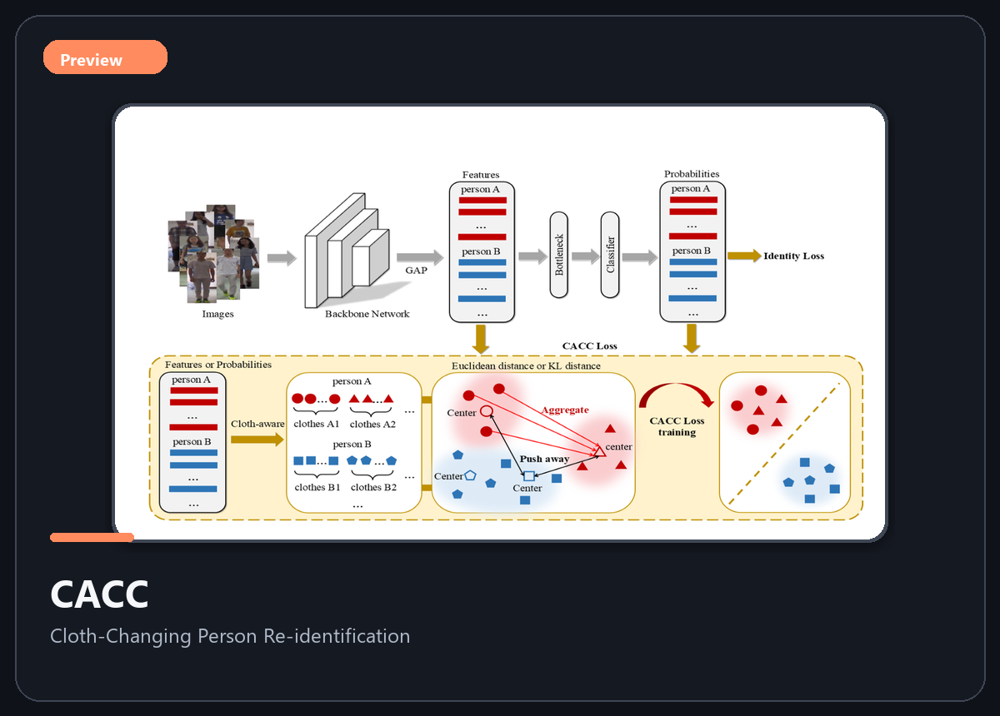
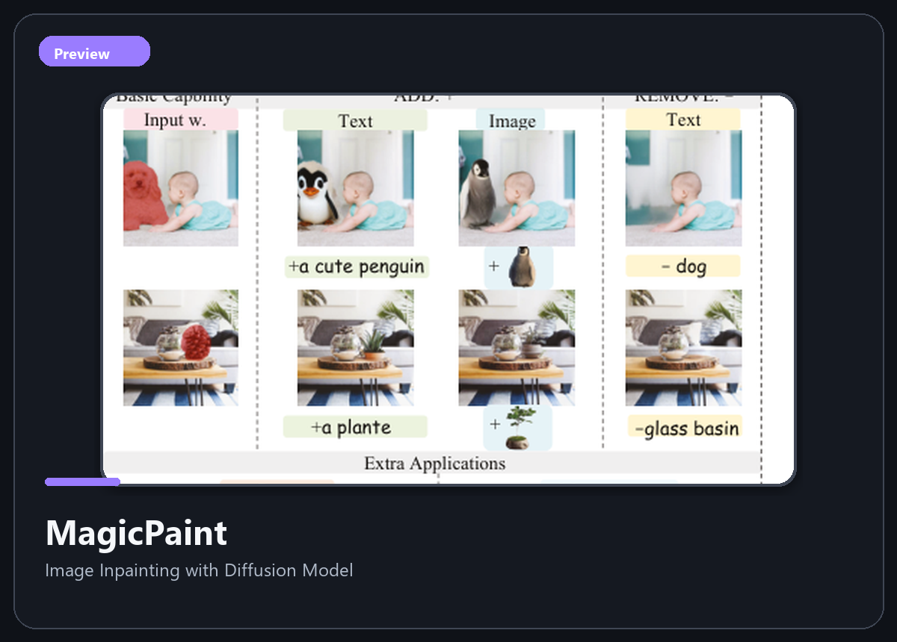

# 科研绘图

从草图到成品的科研绘图资料仓，集中收录多个项目的绘图源文件、海报、报告幻灯片与其他可编辑展示资产。

> [!TIP]
> 点击上方项目预览或下方项目导航，即可进入对应项目目录查看绘图源文件、海报、报告幻灯片与论文入口。

## 🖼️ 项目预览

<table>
  <tr>
    <td align="center" width="50%">
      
    </td>
    <td align="center" width="50%">
      
    </td>
  </tr>
  <tr>
    <td align="center" width="50%">
      
    </td>
    <td align="center" width="50%">
      
    </td>
  </tr>
</table>

## 🧭 项目导航

| Project | Topic | Resources |
| --- | --- | --- |
| [AT-ReID](./AT-ReID) | 👤 Anytime Person Re-Identification | [Paper](https://arxiv.org/abs/2509.16635) / [Repo](https://github.com/kw66/AT-ReID) / [小红书](http://xhslink.com/o/8czcPQfNziK) |
| [CIFT](./CIFT) | 🌗 Visible-Infrared Person Re-identification | [Paper](https://arxiv.org/abs/2208.00967) / [知乎](https://zhuanlan.zhihu.com/p/552705108) / [小红书](http://xhslink.com/o/9Q48HKNssj6) |
| [CACC](./CACC) | 👕 Cloth-Changing Person Re-identification | [Paper](https://link.springer.com/chapter/10.1007/978-3-031-18907-4_41) / [小红书](http://xhslink.com/o/2IpZCVmnoM6) |
| [MagicPaint](./MagicPaint) | 🎨 Image Inpainting with Diffusion Model | [Paper](https://doi.org/10.1609/aaai.v40i14.38151) / [Repo](https://github.com/littleYaang/MagicPaint) / [小红书](http://xhslink.com/o/1mBuHa2IU4U) |

## 📦 仓库定位

- 这个仓库只存放科研绘图与展示资产，不承载训练或评测代码。
- 每个子目录对应一个具体项目，收录该项目的绘图源文件、海报、幻灯片与相关入口。
- 具体到每个项目的论文、仓库、社媒与引用信息，请进入各自子目录查看。
