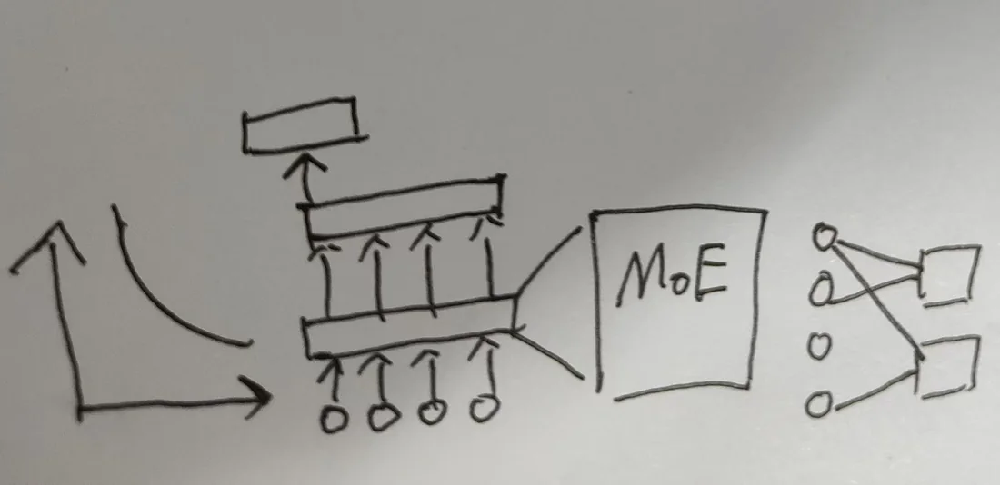

# 科研绘图PPT

从草图到成品的科研绘图资料仓，集中收录多个项目的绘图源文件、海报、报告幻灯片与其他可编辑展示资产。
论文项目中的画图 PPT 会尽量保留从草稿到成品的逐步修改过程，方便查看结构组织、视觉层级、配色和排版如何一步一步完善。

[🏠 作者主页](https://kw66.github.io/)

  

## 🖼️ 项目预览

<table>
  <tr>
    <td align="center" width="50%">
      
    </td>
    <td align="center" width="50%">
      
    </td>
  </tr>
  <tr>
    <td align="center" width="50%">
      
    </td>
    <td align="center" width="50%">
      
    </td>
  </tr>
  <tr>
    <td align="center" width="50%">
      
    </td>
    <td align="center" width="50%">
      
    </td>
  </tr>
  <tr>
    <td align="center" width="50%">
      
    </td>
    <td align="center" width="50%">
      
    </td>
  </tr>
  <tr>
    <td align="center" width="50%">
      
    </td>
    <td align="center" width="50%">
      
    </td>
  </tr>
</table>

## 🧭 项目导航

| Project | Topic | Resources |
| --- | --- | --- |
| [画图合集](./FigureCollection) | 🧩 所有子项目成品图合集 | [PPT](./FigureCollection/画图合集.pptx) |
| [AT-ReID](./AT-ReID) | 👤 全时段行人重识别 | [Paper](https://arxiv.org/abs/2509.16635) / [小红书](https://www.xiaohongshu.com/discovery/item/68c02154000000001b01d7c0?source=webshare&xhsshare=pc_web&xsec_token=ABhDhrSjqfjkG1p5aeLcAw50czbo-l4rVsZE4IlAOZ_KA=&xsec_source=pc_share) |
| [CCIL](./CCIL) | 👕 换衣行人重识别 | [Paper](https://arxiv.org/abs/2305.06145) |
| [CIFT](./CIFT) | 🌗 可见光-红外行人重识别 | [Paper](https://arxiv.org/abs/2208.00967) / [知乎](https://zhuanlan.zhihu.com/p/552705108) / [小红书](https://www.xiaohongshu.com/discovery/item/68c13cf2000000001c005ead?source=webshare&xhsshare=pc_web&xsec_token=ABcRHrIsVlkDvGFOMzLh4lQlSMQIxJnVwD3zVs_8hcUL8=&xsec_source=pc_share) |
| [MFEN](./MFEN) | 🌗 可见光-红外行人重识别 | [Paper](https://arxiv.org/abs/2606.12051) |
| [ANFI](./ANFI) | 👤 行人重识别 | [Paper](https://arxiv.org/abs/2607.25407) / Citation: To be updated |
| [CACC](./CACC) | 👕 换衣行人重识别 | [Paper](https://link.springer.com/chapter/10.1007/978-3-031-18907-4_41) / [小红书](https://www.xiaohongshu.com/discovery/item/68c7b7e5000000001b020cc3?source=webshare&xhsshare=pc_web&xsec_token=ABb8dtsGhj1yUsvmXxa-W9RO_34CyNajXrPQMBxH9CZdc=&xsec_source=pc_share) |
| [MagicPaint](./MagicPaint) | 🎨 扩散模型图像修复 | [Paper](https://doi.org/10.1609/aaai.v40i14.38151) / [Repo](https://github.com/littleYaang/MagicPaint) / [小红书](http://xhslink.com/o/1mBuHa2IU4U) |
| [ColorAnalysis](./ColorAnalysis) | 🎨 科研绘图配色避坑分析 | [小红书](http://xhslink.com/o/9frz2vr2R8o) |
| [ColorPalette](./ColorPalette) | 🧩 科研绘图常用色阶与 PPT 配色模板 | [小红书](http://xhslink.com/o/2vuGC6sZEP5) |
