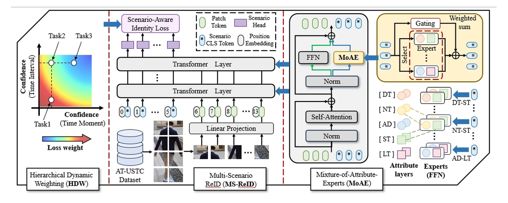
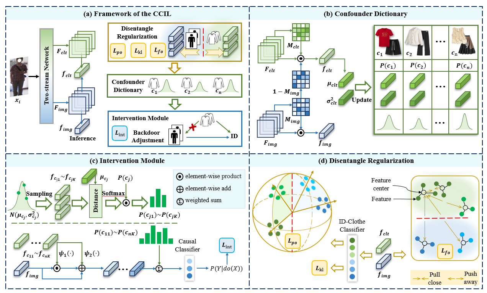
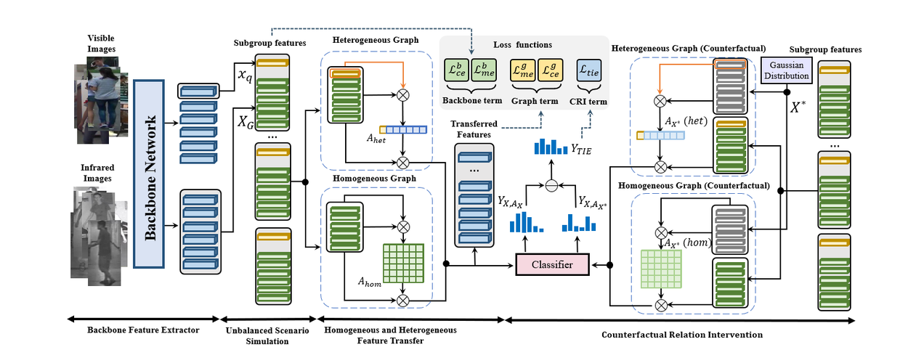
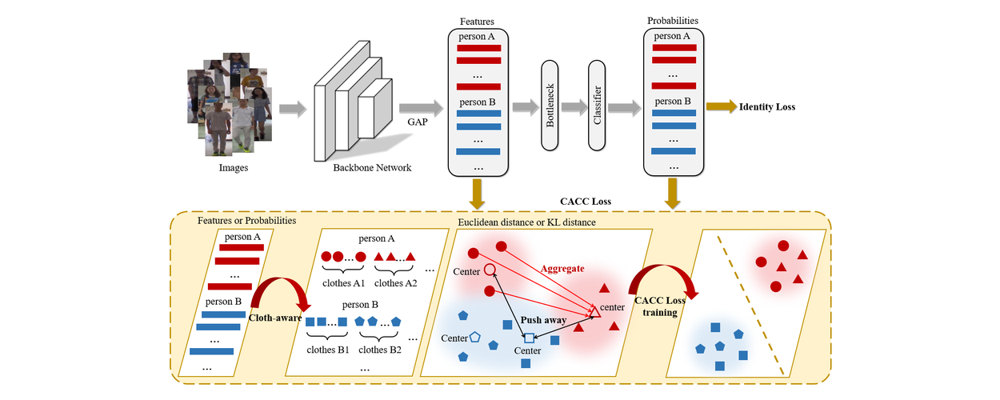
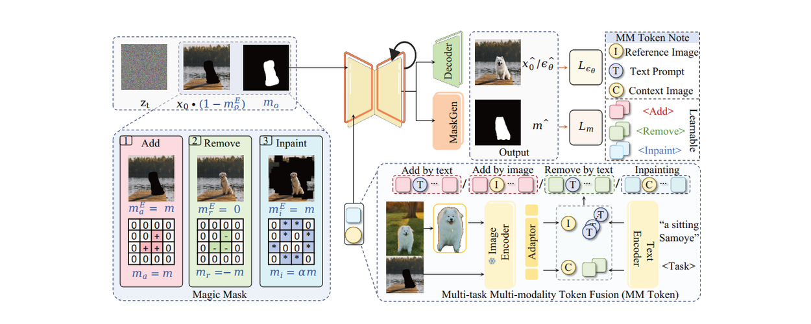
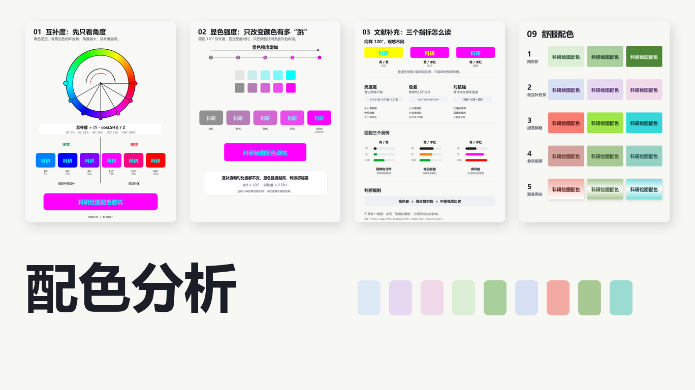

# 科研绘图

从草图到成品的科研绘图资料仓，集中收录多个项目的绘图源文件、海报、报告幻灯片与其他可编辑展示资产。

[🏠 个人主页](https://kw66.github.io/)

## 🖼️ 项目预览

<table>
  <tr>
    <td align="center" width="50%">
      
    </td>
    <td align="center" width="50%">
      
    </td>
  </tr>
  <tr>
    <td align="center" width="50%">
      
    </td>
    <td align="center" width="50%">
      
    </td>
  </tr>
  <tr>
    <td align="center" width="50%">
      
    </td>
    <td align="center" width="50%">
      
    </td>
  </tr>
  <tr>
    <td align="center" width="50%">
      
    </td>
    <td align="center" width="50%">
      
    </td>
  </tr>
</table>

## 🧭 项目导航

| Project | Topic | Resources |
| --- | --- | --- |
| [AT-ReID](./AT-ReID) | 👤 任意时间行人重识别 | [Paper](https://arxiv.org/abs/2509.16635) / [Repo](https://github.com/kw66/AT-ReID) / [小红书](http://xhslink.com/o/8czcPQfNziK) |
| [CCIL](./CCIL) | 👕 换衣行人重识别 | [Paper](https://arxiv.org/abs/2305.06145) |
| [CIFT](./CIFT) | 🌗 可见光-红外行人重识别 | [Paper](https://arxiv.org/abs/2208.00967) / [知乎](https://zhuanlan.zhihu.com/p/552705108) / [小红书](http://xhslink.com/o/9Q48HKNssj6) |
| [MFEN](./MFEN) | 🌗 可见光-红外行人重识别 | [Paper](https://arxiv.org/abs/2606.12051) |
| [CACC](./CACC) | 👕 换衣行人重识别 | [Paper](https://link.springer.com/chapter/10.1007/978-3-031-18907-4_41) / [小红书](http://xhslink.com/o/2IpZCVmnoM6) |
| [MagicPaint](./MagicPaint) | 🎨 扩散模型图像修复 | [Paper](https://doi.org/10.1609/aaai.v40i14.38151) / [Repo](https://github.com/littleYaang/MagicPaint) / [小红书](http://xhslink.com/o/1mBuHa2IU4U) |
| [ColorAnalysis](./ColorAnalysis) | 🎨 科研绘图配色避坑分析 | [小红书](http://xhslink.com/o/9frz2vr2R8o) |
| [ColorPalette](./ColorPalette) | 🧩 科研绘图常用色阶与 PPT 配色模板 | [小红书](http://xhslink.com/o/2vuGC6sZEP5) |
